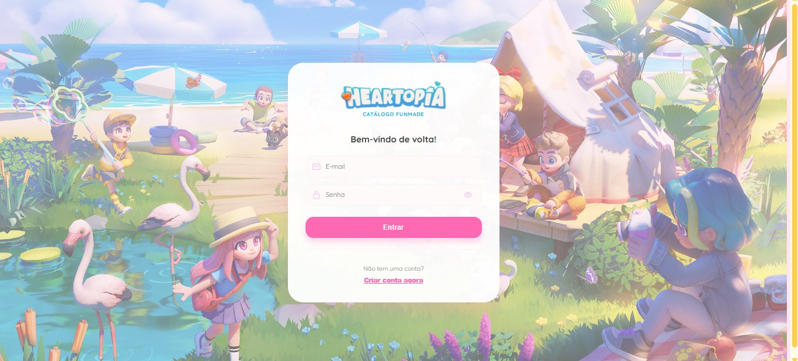
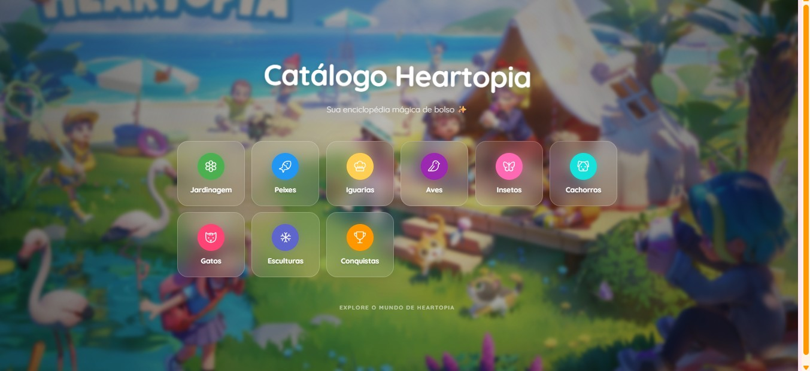
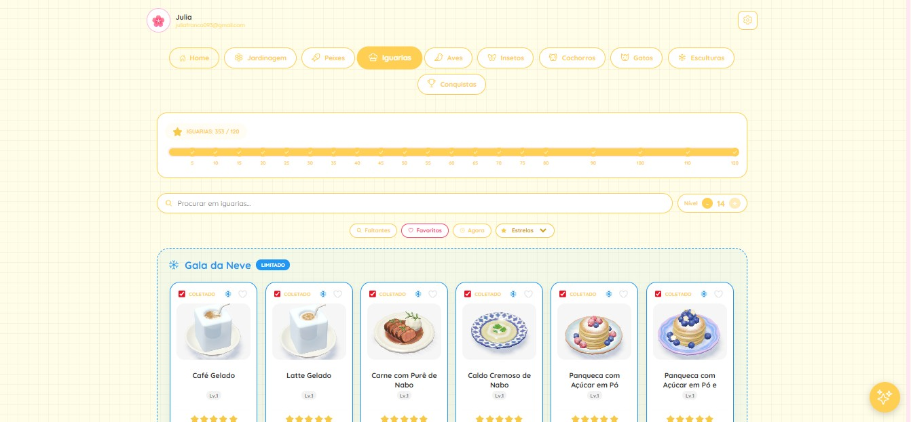
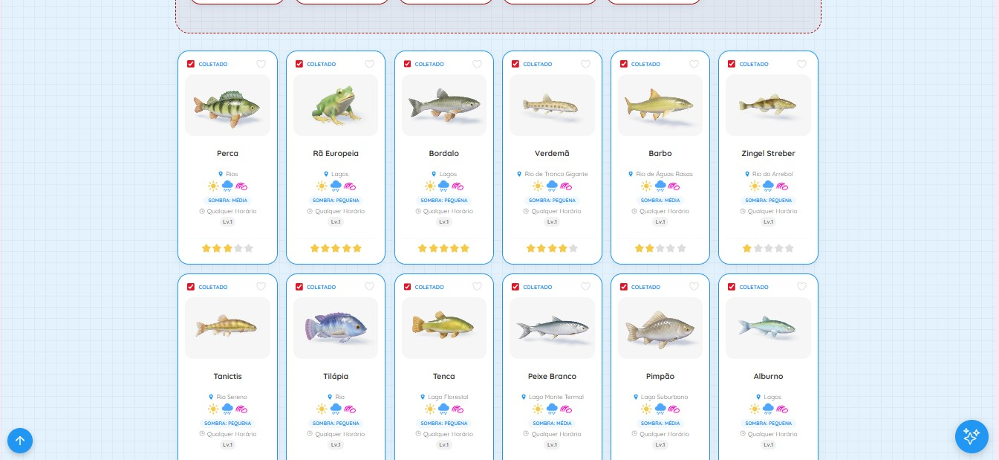

# 🌸 `Heartopia: Catálogo e Guia Interativo (WEB)`

> **Protótipo Independente de Estudo**: Desenvolvido para fins de aprendizado e aprimoramento técnico.

Este repositório contém o código-fonte da **plataforma web fanmade de catálogo e guia do jogo Heartopia**. Desenvolvida com React e Vite, a aplicação oferece um catálogo interativo de itens do jogo, com sistema de progresso, integração com inteligência artificial e persistência em nuvem.

---

## 💡 `Sobre o Projeto`

O projeto foi desenvolvido como um projeto de estudo com foco em aplicar conceitos modernos de desenvolvimento web, criando uma experiência interativa e visualmente agradável para acompanhar colecionáveis dentro de um jogo.

Neste projeto, o foco foi:

* **Experiência do Usuário:** Interface intuitiva e responsiva.
* **Visualização de Progresso:** Barras dinâmicas para acompanhamento de coleção.
* **Integração com IA:** Sistema de chat inteligente para auxiliar o usuário.
* **Persistência de Dados:** Salvamento e sincronização em nuvem.

---

## 💻 `Telas Principais`

| Login | Início |
| :---: | :---: |
|  |  |

| Catálogo | Visualização de Itens |
| :---: | :---: |
|  |  |

---

## 🛠️ `Stack Tecnológica`

| Camada | Tecnologia | Descrição |
| :--- | :--- | :--- |
| **Interface Web** | React.js | Biblioteca para construção de interfaces reativas |
| **Build Tool** | Vite | Ferramenta moderna e rápida para desenvolvimento |
| **Inteligência Artificial** | Groq API | Respostas rápidas e inteligentes no chat |
| **Backend / DB** | Firebase | Persistência de dados em tempo real |
| **Deploy** | GitHub Pages | Hospedagem estática da aplicação |

---

## 🔔 `Funcionalidades Implementadas`

| Funcionalidade | Descrição |
| :--- | :--- |
| **Catálogo Completo** | Listagem detalhada de aves, peixes e colecionáveis |
| **Sistema de Progresso** | Barras dinâmicas de conclusão por categoria |
| **Selos de Nível** | Identificação visual de raridade dos itens |
| **Guia da Natureza (IA)** | Chat inteligente integrado |
| **Sincronização Cloud** | Salvamento automático com Firebase |

---

## 👤 `Desenvolvedora`

* **Julia Franco**
